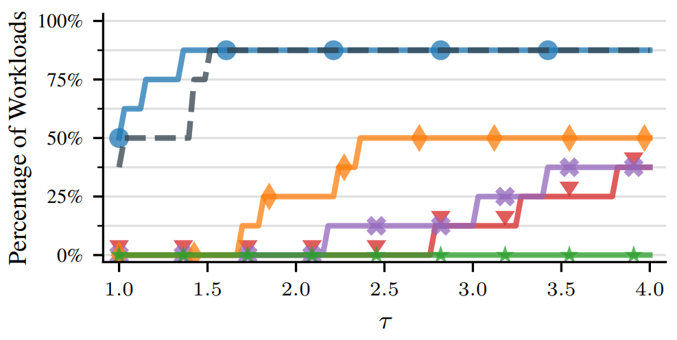

# MLCommons™ AlgoPerf: Technical Documentation & FAQs

**Version:** 0.0.21 *(Last updated February 20, 2024)*

> **TL;DR** New training algorithms and models can make neural net training faster.
> We need a rigorous training time benchmark that measures time to result given a fixed hardware configuration and stimulates algorithmic progress. We propose a *Training Algorithm Track* and a *Model Track* in order to help disentangle optimizer improvements and model architecture improvements. This two-track structure lets us enforce a requirement that new optimizers work well on multiple models and that new models aren't highly specific to particular training hacks. The following is the technical documentation for the Training Algorithm Track.

## Table of Contents <!-- omit from toc -->

- [Introduction](#introduction)
- [Technical Documentation of the Training Algorithm Track](#technical-documentation-of-the-training-algorithm-track)
  - [Competition Rules](#competition-rules)
  - [Submissions](#submissions)
    - [Specification](#specification)
    - [Evaluation during training](#evaluation-during-training)
    - [Valid submissions](#valid-submissions)
  - [Tuning](#tuning)
    - [External tuning ruleset](#external-tuning-ruleset)
    - [Self-tuning ruleset](#self-tuning-ruleset)
  - [Workloads](#workloads)
    - [Fixed workloads](#fixed-workloads)
    - [Randomized workloads](#randomized-workloads)
    - [Qualification set](#qualification-set)
  - [Scoring](#scoring)
    - [Benchmarking hardware](#benchmarking-hardware)
    - [Defining target performance](#defining-target-performance)
    - [Benchmark score using performance profiles](#benchmark-score-using-performance-profiles)
  - [Version freeze](#version-freeze)
- [FAQs](#faqs)
  - [Setup and Platform](#setup-and-platform)
    - [My machine only has one GPU. How can I use this repo?](#my-machine-only-has-one-gpu-how-can-i-use-this-repo)
    - [How do I run this on my SLURM cluster?](#how-do-i-run-this-on-my-slurm-cluster)
    - [How can I run this on my AWS/GCP/Azure cloud project?](#how-can-i-run-this-on-my-awsgcpazure-cloud-project)
  - [Submitting](#submitting)
    - [Can I submit multiple times to the benchmark competition?](#can-i-submit-multiple-times-to-the-benchmark-competition)
    - [Can my submission be structured using multiple files?](#can-my-submission-be-structured-using-multiple-files)
    - [Can I install custom dependencies?](#can-i-install-custom-dependencies)
    - [How can I know if my code can be run on benchmarking hardware?](#how-can-i-know-if-my-code-can-be-run-on-benchmarking-hardware)
    - [Are we allowed to use our own hardware to self-report the results?](#are-we-allowed-to-use-our-own-hardware-to-self-report-the-results)
    - [What can I do if running the benchmark is too expensive for me?](#what-can-i-do-if-running-the-benchmark-is-too-expensive-for-me)
    - [Can I submit previously published training algorithms as submissions?](#can-i-submit-previously-published-training-algorithms-as-submissions)
- [Disclaimers](#disclaimers)
  - [Shared Data Pipelines between JAX and PyTorch](#shared-data-pipelines-between-jax-and-pytorch)

## Introduction

We need a more scientifically sound methodology for evaluating training speedups due to new algorithms, including both new optimizers and new model architectures. Cutting edge machine learning (ML) models are exceeding the compute budgets of many researchers, and ML compute is becoming a larger and larger cost in industry. To reduce the compute and potentially environmental cost of ML research and practice, we need rigorous benchmarking of efficiency. Such benchmarks will guide us in selecting the best directions to evolve existing techniques and ultimately enable progress toward models that produce not only better results, but better results **at lower cost**.

MLCommons' mission is to build fair and useful benchmarks for measuring training and inference performance of ML hardware, software, and services. Improvements in training speed can come from better hardware, better software stacks, and better algorithms.
To date, the Closed Division of the MLPerf™ Training benchmark has been extremely successful in driving systems innovation by requiring mathematical equivalence to a reference implementation, while still allowing submissions on different hardware. Although the Open Division allows new models and training algorithms, it has several issues that make it inappropriate as a benchmark for progress in training algorithms. By allowing arbitrary hardware, it is impossible to isolate improvements due to algorithms or due to extra computation. Unrestricted hardware makes the benchmark only accessible to the most well-funded organizations, even if many academic labs and others have interesting algorithms to measure. Finally, even if we could isolate improvements due to particular algorithmic changes and make the benchmark more broadly accessible, there is still no incentive to avoid hyper-specific changes that only help the particular benchmark workload.

In order to drive innovation in machine learning algorithms that reduce the time needed to create useful models, we propose a new set of benchmarks called **AlgoPerf** to evaluate the training time for different algorithms (models, optimizers, preprocessing, etc.) on a **fixed hardware configuration** (future iterations can adopt new hardware configurations as needed). Our proposal includes two tracks: (1) the **Training Algorithm Track** and (2) the **Model Track**. The goal of the Training Algorithm Track is to find training algorithms (optimizers, etc.) that train benchmark models to reach the goal out-of-sample error rate as fast as possible. However, to incentivize practically useful algorithms, in the Training Algorithm Track we require that a single training algorithm simultaneously performs well across all benchmark models and datasets. Similarly, the goal of the Model Track is to find models that can be trained to achieve the target solution quality (out-of-sample error) in the least amount of time on each benchmark dataset. Although submissions in the Model Track will be inherently dataset-specific, we sharply constrain what parts of the training program can be modified in the Model Track and require submitted models to be easily trainable using standard optimizers. Thus the two-track structure discourages overly specific solutions that aren't generally useful to practitioners and will hopefully produce evidence on the relative returns of speeding up training by finding new models or by developing new training algorithms.

In the following, we will focus on the **Training Algorithm Track** of the *AlgoPerf benchmark*.

## Technical Documentation of the Training Algorithm Track

The goal of the **AlgoPerf: Training Algorithm Track** is to reach the same results faster ("time to result") by using better optimizers, data ordering/weighting schemes, and weight update strategies while producing techniques that work well on a wide variety of models and datasets. We hope to encourage generally useful training algorithms that are not specific to only a small number of particular workloads.

In general, submissions to the Training Algorithm Track will replace specific pieces of a reference implementation in order to produce a training program that reaches the same results faster on as many workloads as possible. The training program has a fixed, high-level structure and competitors are allowed to replace a particular set of functions in the program (the [**submission functions**](#submission-functions)), but must leave all other pieces ([**fixed functions**](#fixed-functions) and high-level structure) of the reference implementation unchanged. The submitted code must perform well on multiple datasets and models simultaneously (a model and dataset pair constitute a [workload](#workloads) for the purposes of this track).

Submissions to the Training Algorithm Track can be entered under two separate rulesets, named [external tuning ruleset](#external-tuning-ruleset) and [self-tuning ruleset](#self-tuning-ruleset), with it being possible to submit to both rulesets. The main difference is that the external tuning ruleset allows moderate, automatic, parallel tuning of the optimizer's hyperparameters on each workload, using the submitted workload-agnostic search space. This allows the training algorithm to adapt to a particular task while ensuring that it is not too difficult to tune automatically. Under the self-tuning ruleset, there is no external tuning and submissions need to adapt to a particular task autonomously within a single optimization run. Unless otherwise specified, the rules in this section apply to both rulesets (see, for example, the [Tuning](#tuning) section for the most substantial difference between the rulesets).

The intention is that a training algorithm submission will be broadly applicable and useful without customization to the specific [workload](#workloads) (model, dataset, loss function). We want to discourage detecting the particular workload and doing something highly specific that isn't generally useful. In order to further discourage submissions that overfit to the particular [fixed benchmark workloads](#fixed-workloads), submissions will also be evaluated on [held-out workloads](#randomized-workloads) specified after the submission deadline.

### Competition Rules

For a description of the competition rules and how to submit a training algorithm to the AlgoPerf: Training Algorithms Benchmark, see the [Competition Rules](/COMPETITION_RULES.md), which details the entire competition process.

### Submissions

A valid submission is a piece of code that defines all of the submission functions and is able to train all benchmark workloads on the [benchmarking hardware](#benchmarking-hardware) (defined in the [Scoring](#scoring) section). Both the validation set and the test set performance will be checked regularly during training (see the [Evaluation during training](#evaluation-during-training) section), however, only the validation performance is relevant for scoring. Training halts when the workload-specific [target performance](#defining-target-performance) for the validation and test sets have been reached. For each workload, only the training time to reach the *validation* set target error is used as input to the [scoring process](#scoring) for the submission. Submissions using [external tuning](#external-tuning-ruleset) will be tuned independently for each workload using a single workload-agnostic search space for their specified hyperparameters. The tuning trials are selected based on the time to reach the *validation* target. Submissions under either tuning ruleset may always self-tune while on the clock.

#### Specification

Any function defined in the reference implementations that isn't a [submission function](#submission-functions) is a [fixed function](#fixed-functions) for the Training Algorithm Track. No submitted code is run to compute the evaluation metrics in the Training Algorithm Track. We just use the final model parameters and the fixed functions from this track at test time.

In principle, submissions are allowed to use the available hardware systems in any data- or model-parallel manner they desire, within the constraints of the submission function APIs. However, in practice, model-parallelism may not be possible with the API. They are allowed to access any framework-specific device information necessary to exploit the hardware.

Submissions provide a [per-workload batch size](#batch-size-getter) to use. Specification of the batch size for each workload is necessary to avoid running out of memory for different workloads. Therefore, submitters can determine this batch size in advance and specify it as part of the submission. Submitters may also provide per-workload batch sizes for all [randomized workloads](#randomized-workloads). If no such batch size is provided for a randomized workload, by default, submissions will then use the batch size of the most similar [fixed workload](#fixed-workloads) (for example, if there is an ImageNet fixed workload and also a randomized workload with a similarly sized model on similarly sized images, the ImageNet batch size will be used for held-out workloads generated from this randomized workload).
Note that submitters are *not* allowed to modify the *evaluation batch size*, which is set by the benchmarking codebase. However, you can file an issue if you believe that the evaluation batch size of a particular workload is set inappropriately. The working group will review this request and consider adjusting the evaluation batch size in the benchmarking codebase, thus affecting all submitters equally.

The **submission functions** are the *batch size getter*, *optimizer state initializer*, *variable update*, and *data selection functions*. The *fixed functions* are the *data augmentation/preprocessing*, *model initialization*, *forward pass*, and *loss function*. The trained model will be evaluated in a separate step that does not call any of the submitted code.

##### Fixed functions

With the exception of `_build_input_queue`, submitters can call any of these functions (along with any public function in the provided `Workload` instance) at any time in their submitted functions.

```python
@property
def step_hint(self): -> int
```

- The `step_hint` function gives the number of global steps the baseline algorithm was allowed to use to reach the targets for a workload. Note that the baseline algorithms may have reached the target in fewer steps than this, but these were the max number of steps the baseline algorithms used for their learning rate schedules. Submitters can use this to help specify learning rate (or other) schedules.

###### Data augmentation and preprocessing

```python
def _build_input_queue(
    self,
    data_rng: RandomState,
    split: str,
    data_dir: str,
    global_batch_size: int) -> Iterator[Dict[str, Tensor]]:
```

- The `_build_input_queue` function will be called to produce the iterator over batches that the submitted data selection function consumes. It is responsible for all data reading, shuffling, repeating, preprocessing, and batching. Note that for Jax this should return an iterator over tensors of shape `(num_devices, per_device_batch_size, ...)`, and for PyTorch this should return tensors of shape `(per_device_batch_size, ...)` (assuming PyTorch's [DDP](https://pytorch.org/docs/stable/notes/ddp.html) is used).

###### Model initialization

```python
def init_model_fn(
    self,
    rng: RandomState,
    dropout_rate: Optional[float] = None,
    aux_dropout_rate: Optional[float] = None
) -> initial model parameters
```

- Unlike in the *Model Track*, this function that initializes the parameters of the model, is fixed. While it can be called by the submission (e.g. to restart the model after a failed training effort) it cannot be changed.

###### Forward pass

```python
def model_fn(
    self,
    params: ParameterContainer,
    augmented_and_preprocessed_input_batch: Tensor,
    model_state: ModelAuxiliaryState,
    mode: ForwardPassMode,  # mode \in {train, eval}
    rng: RandomState,
    hyperparameters: Hyperparameters,
    update_batch_norm: bool
) -> (logits_output_batch, new_model_state): Tuple[Tensor, ModelAuxiliaryState]
```

- `params` is whatever the structure is that contains the (`float32`) model parameters. The naming is overloaded due to having to handle the more object-oriented `PyTorch` style and the functional `JAX` style of development. In the `Flax` library (written in `JAX`), this is typically a nested dictionary of `JAX`/`numpy` arrays, but in `PyTorch` this is the `torch.nn.Model`.
- It is possible that `model_parameters` will be endowed with additional information about the kind of each parameter, e.g. "weights" or "bias" or "batch norm", although `model_fn` does not really need that information we might use the same nested structure elsewhere
- `logits_output_batch` is before the output activation
- `new_model_state` is for batch norm or similar side effects and will only be updated if `update_batch_norm` is set
- `hyperparameters` will contain only dropout rates, which will be used in the models that support it. These can be tuned or will default to documented model-specific values. Note that adding additional dropout would be considered changing the model, which is not allowed, but the tuning of dropout in existing dropout layers can be considered a regularizer, so we allow it. There should be at most two dropout rates in a model (if there are more than two we will reuse the same values).

###### Loss function

```python
def loss_fn(
    self,
    # Dense or one-hot labels, or a tuple of (tensor, padding) for speech.
    label_batch: Union[Tuple[Tensor, Tensor], Tensor],
    logits_batch: Union[Tuple[Tensor, Tensor], Tensor],
    mask_batch: Optional[Tensor] = None,
    label_smoothing: float = 0.0) -> Dict[str, Tensor]  # differentiable
```

- Unlike in the *Model Track*, we will specify the loss function name in order to let training algorithms depend on the loss function. It will be one of {**mean squared error**, **cross-entropy**, **CTC**, or **L1 reconstruction error**}.
  - The optimizer must work with all values of the enum, which will be provided via a property on the workload object that is provided to all submissions functions.
- The loss function does **not** include regularization. Instead, regularization can be added by the submissions in the `update_params` function.
- The loss function returns a dict {'summed': scalar summed loss, 'n_valid_examples': scalar number of valid examples in batch, 'per_example': 1-d array of per-example losses}.
  Note that the returned quantities are not synced across devices; this can be done by the user in the `update_params` function.

##### Submission functions

###### Batch size getter

```python
def get_batch_size(workload_name: str) -> int
```

- Submitters define a specific batch size for each [workload](#workloads).
- For example, in advance, they can determine the largest batch size without running out of memory for each workload.
- For the [held-out workloads](#randomized-workloads), by default, this function will use the `workload_name` of the fixed workload it is based on.
- This does not affect the *evaluation batch size* (i.e. the batch size used during the evaluation phase), which is, by design, a quantity submitters are not allowed to change.

###### Optimizer state initializer

```python
def init_optimizer_state(
    workload: Workload,
    model_params: ParameterContainer,
    model_state: ModelAuxiliaryState,
    hyperparameters: Hyperparameters,
    rng: RandomState
) -> initial_optimizer_state
```

- Allowed to create state for the optimizer
- Does not involve the initialization for the model parameters, which in the Training Algorithm Track, is considered a fixed function, see [Model initialization](#model-initialization).
- The optimizer state is a dictionary (`Dict[str, Any]`). For a PyTorch submission, any value in this dictionary which is a class instance with internal state has to have a `state_dict()` method implemented to be stored correctly at the training checkpoints.

###### Variable update function

```python
def update_params(
    workload: Workload,
    current_param_container: ParameterContainer,
    current_params_types: ParameterTypeTree,
    model_state: ModelAuxiliaryState,
    hyperparameters: Hyperparameters,
    batch: Dict[str, Tensor],
    loss_type: LossType,
    optimizer_state: OptimizerState,
    train_state: Dict[str, Any],
    eval_results: List[Tuple[int, float]],
    global_step: int,
    rng: RandomState
) -> (updated_optimizer_state, updated_variables, updated_model_state)
```

- `current_param_container` is the same kind of nested structure as used by `model_fn` which constitutes a nested collection of `float32` arrays, each endowed with information about what kind of parameter that array represents stored in a parallel structure of `current_params_types`.
  - Parameter kind is one of {"weights", "biases", "embeddings", "conv", "batch norm"}.
- `model_state` holds auxiliary state necessary for some models, such as the current batch norm statistics.
- The loss function will be one of a small set of known possibilities and the update function is allowed to branch on the `loss_type` enum/name.
- The `loss_fn` produces a loss per example and a summed loss (both only for one device), which both can be used.
- Allowed to update state for the optimizer.
- Uses the `model_fn` of the `workload` in order to decouple the loss from the model so that model outputs (forward passes) can be reused (by storing them in the optimizer state).
- The submission can access the elapsed training time and get further information about the evaluation through `train_state`.
- The submission can access the target evaluation metric via the `workload` variable.
- **A call to this function will be considered a step**
  - The time between a call to this function and the next call to this function will be considered the per-step time.
- Cannot modify the given hyperparameters in a workload-conditional way (please see the [Valid submission](#valid-submissions) section). This rule is intended to prohibit circumventing the tuning rules by looking up a pre-tuned optimal set of hyperparameters for each workload. It is not intended to prohibit line searches and other similar techniques.
- The fixed `init_model_fn` can optionally be called during training, for example, to reinitialize the model after a failed training effort.
- Cannot replace the model parameters with pre-trained ones.
- This API supports Polyak averaging and similar methods that implement moving averages of model parameters.
- Batch norm should work here because the `model_fn` will return updated batch norm moving averages when it is told to with `update_batch_norm`.

###### Data selection

```python
def data_selection(
    workload: Workload,
    input_queue: Iterator[Tuple[Tensor, Tensor]],
    optimizer_state: OptimizerState,
    current_param_container: ParameterContainer,
    hyperparameters: Hyperparameters,
    global_step: int,
    rng: RandomState
) -> Dict[str, Tensor]
```

- `input_queue` can yield up to the number of elements in the training dataset
- Want to allow for submitters to construct their own data batches from the dataset
- Submissions are allowed to arbitrarily modify the input examples, as long as the modifications are sufficiently generic to be applicable to any workload
- This is only called on the training inputs. **No submitted code will be called at eval in the training track.**
- This allows for any of the following methods:
  - Data echoing
  - Curriculum learning
  - Bootstrapping
  - Biased sampling (based on loss values, so need to store the forward pass in the `optimizer_state`, potentially forward pass of a cheaper proxy model)
  - Submissions need batching control

#### Evaluation during training

In general, with noisy, non-deterministic training, evaluation frequency can affect training time measurements as more "bites of the apple" potentially allows the training code to exploit instability. We also want to discourage submissions from complicated and unrealistic logic that attempts to guess when training is close to complete and increases the evaluation rate, while not producing a well-sampled training curve at the start of training. Simply allowing submissions complete freedom over evaluation frequency encourages competitors to work to minimize the number of evaluations, which distracts from the primary goal of finding better training algorithms.

Submissions are eligible for an untimed eval every `eval_period` seconds, run as soon as the current call of `update_params` completes. Any additional evaluations performed by the submission code count against the runtime for scoring. The harness that runs the submission code will attempt to eval every `eval_period` seconds by checking between each submission step (call of `update_params`) whether it has been at least `eval_period` seconds since that last eval and, if so, pausing the clock and running an eval. This means that if calls to `update_params` typically take a lot more than `eval_period` seconds, such submissions will not receive as many untimed evals as a submission that had an `update_params` function that took less time. However, for appropriate settings of `eval_period`, we expect this to be quite rare. Submissions are always free to restructure their `update_params` code to split work into two subsequent steps to regain the potential benefits of these untimed model evaluations. For each workload, the `eval_period` will be set such that the total evaluation time is roughly between 10% and 20% of the total training time for the target-setting runs.

#### Valid submissions

The intention of this benchmark is to identify training algorithm submissions that will be broadly applicable and effective in practical scenarios without customization to the specific [workload](#workloads) (model, dataset, and loss function). Generally useful training algorithms can train models faster and thus require less compute resources, decreasing the cost of machine learning. We want to discourage all submissions that sidestep the purpose of this benchmark. We welcome creative ideas and novel research. Therefore, the API aims to allow a wide variety of submissions. However, in some cases, routines that would be allowed in principle might not be practically feasible to express in the provided framework.

Submissions that specialize to the specific workloads in the benchmark and have not been implemented in a way that plausibly generalizes to novel workloads are prohibited.
In order to help clarify which submissions are [allowed](#allowed-submissions) and [disallowed](#disallowed-submissions), we described a few examples below. Two essential questions can help provide a general guideline for whether a submission is allowed or not:

1. What **information** is being used by the submission?
2. What **action** is the submission code taking based on this information?

In general, both parts are needed to decide if a particular piece of code is within the spirit of the rules. For example, it is fine to use the shape information of the model parameters to switch between a low-memory and a high-memory approximation, but it isn't allowed to use this shape as a "fingerprint" to uniquely identify a workload and then use pre-computed hyperparameters for this specific workload. As a rule of thumb, submissions are allowed if it is reasonable to assume that the method will work comparably well on unseen workloads automatically without requiring human engineering labor.

##### Allowed submissions

Submissions are allowed to use the provided model parameter information, e.g. the shapes and types of the layers, if the resulting action works on generic workloads.

<details>
<summary>Examples:</summary>

- Using shape information of the parameters to switch between low-memory and high-memory routines is allowed.
- Using shape information of the parameters to conditionally construct variables to avoid running out of memory, e.g. by approximating larger matrices, is allowed.
- Using the ordering of the parameters to train deeper layers differently, e.g. training them sequentially, is allowed.
- Submissions are allowed to use the layer type to change the update rules, e.g. use a different update rule for all batch normalization layers, or use different sub-routines for each layer type, e.g. compute variances for convolutional layers but not for batch normalization layers.

</details>
<br>

Automatic methods for determining or dynamically setting hyperparameters are allowed if they function on generic workloads.

<details>
<summary>Examples:</summary>

- Submissions are allowed to use automatic procedures for setting hyperparameters, e.g. automated learning rate range tests.
- Inner-loop tuning methods for setting hyperparameters, e.g. line searches, are allowed.
- Changing the batch size dynamically during training.

</details>
<br>

Submissions can also be based on learned training algorithms.

<details>
<summary>Examples:</summary>

- Submission are allowed to learn the update rule of the training method.
- In the [self-tuning ruleset](#self-tuning-ruleset), submissions could try out a learned list of hyperparameters.

</details>
<br>

Submissions can use additional software dependencies provided they have the intention of supporting new algorithmic and mathematical ideas. The procedure for adding dependencies is described in more detail in the [Software dependencies](#software-dependencies) section.

<details>
<summary>Examples:</summary>

- [`BackPACK`](https://docs.backpack.pt/en/master/index.html) is a `pip` package that hooks into `PyTorch` to extract additional information from the backward pass. An allowed use of `BackPACK` would be to compute batch statistics (e.g. within-batch gradient variances, etc.) to calibrate or auto-tune training algorithms.

</details>

##### Disallowed submissions

Submissions are not allowed to circumvent the tuning rules by looking up the result of an offline computation that was performed ahead of time.

<details>
<summary>Examples:</summary>

- Submissions are not allowed to look up (pre-trained) model parameters.
- Computing the optimal hyperparameters for every fixed workload offline and having the submission look up those pre-computed values (and finding the closest fixed workload for a held-out workload) is not allowed. In contrast, finding and hard-coding a single good setting of the hyperparameters that works well across all the workloads simultaneously would be allowed.
- Submissions are not allowed to adjust the hyperparameter search spaces for the external tuning ruleset, such that it differs between the workloads.

</details>
<br>

Submissions are not allowed to detect the particular workload (irrespective of which information they use to this end) in order to use settings that are specified for individual workloads. This would result in highly specific behavior that isn't generally useful. This also extends to learned approaches that ultimately detect specific workloads. In general, all else being equal, if some submission was written that was extremely effective on a small set of the workloads (and far worse on the rest) and another submission with the opposite performance pattern, we would prefer both submissions to be submitted and tested on **all** workloads.

<details>
<summary>Examples:</summary>

- A hard-coded switching of the update rule based on the workload is not allowed, e.g. using Adam for RNNs and SGD with momentum on CNNs. Although submissions can specialize for certain layer types in generic ways, they should not uniquely identify a model or dataset. In other words, if there are two workloads A and B that both have convolutional layers and fully connected layers the submission shouldn't detect whether it is dealing with A or B specifically and choose Adam for one and SGD with momentum for the other. However, if the updates for all parameters of convolutional layers always used SGD with momentum and the updates for all other layers always used Adam and a workload with both types of layers had mixed updates, that would be fine.
It is also allowed to make the update rule part of the (external) hyperparameter tuning or determine the optimal update rule during the run, i.e. while "on-the-clock".
- Submissions are not allowed to look up learning rate schedules that are only utilized for specific subsets of the workloads. It is allowed to use one general learning rate schedule or dynamically adapt the learning rate based on general information such as curvature.

</details>
<br>

It is not allowed to compute any kind of pairwise metrics between the fixed workloads and the held-out workloads.

<details>
<summary>Examples:</summary>

- On a held-out workload, submissions are not allowed to find the nearest neighbor among the fixed workloads to set any hyperparameter.

</details>
<br>

Valid submissions must rely on new algorithmic or mathematical ideas and should not use software engineering approaches to speed up primitive operations in `PyTorch`, `JAX`, their dependencies, the operating system, or the hardware. We recognize that the way a method is implemented will impact its performance in the benchmark. It is generally acceptable to make clever, judicious, and efficient use of public APIs in `JAX` and/or `PyTorch` from within the submission function APIs. It is not acceptable to use these APIs to optimize the internals of primitive operations and standard dependencies in ways that could generally benefit any submission.

<details>
<summary>Examples:</summary>

- Submissions are allowed to use `CUDA` streams to schedule operations, e.g., transfering data between CPU and GPU, or among GPUs, while performing other computations.
- Submissions are not allowed to use `CUDA` streams or asynchronous operations (e.g., spawning additional threads) to perform additional computations that run during the [untimed evaluations](#evaluation-during-training).
- Submissions are not allowed to use faster GPU kernels than other submitters by writing their own, using `TVM`, or using a different version of `cuDNN`/`cuBLAS`.
- Submissions are not allowed to skip or reduce system or framework overhead, such as modifying `JAX` to skip internal steps like pytree flattening/unflattening.
- Submissions are not allowed to introduce new compiler optimizations, such as modifying `XLA` to perform more or less kernel fusion.

</details>

##### Submissions vs. Baselines

Submitters may also submit algorithms marked as *baselines*. These baseline algorithms are not eligible for winning the competition or prize money but they are also not required to be "substantially different" from other submissions by the same submitters. Baseline algorithms will still appear on the leaderboard but will be clearly marked as such. We highly encourage the submission of baselines for educational purposes.

Baseline algorithms might, for example, include existing algorithms with different search spaces or learning rate schedules.
Another example involves porting submissions to different frameworks. For instance, a participant may wish to assess their algorithm in both JAX and PyTorch to demonstrate the impact of the framework. However, in such cases, one of these submissions must be designated as eligible for prize consideration, while the other is marked as a baseline. This prevents circumventing of tuning rules and the spirit of the benchmark by creating additional "lottery tickets".
Baselines might not be prioritized when using the compute resources by the sponsors of the benchmark.

##### Software dependencies

We require submissions to use specific versions of `PyTorch`/`JAX` as well as additional dependencies in order to facilitate fair comparisons. Submitters must build on top of these provided software packages, which might be provided as a `Docker` container. Additional dependencies can be added as long as they include a comment describing what was added and why. Submitters are free to add dependencies that support new algorithmic and mathematical ideas but they should not circumvent the intention of the benchmark to measure training speedups due to new training methods. For example, software engineering techniques that lead to faster implementations of existing software, e.g. using newer versions of `PyTorch` or `JAX`, are not allowed and these are described in more detail in the [Disallowed submissions](#disallowed-submissions) section.

##### Environment variables

The benchmark codebase sets environment variables, and submitters are not permitted to modify (or add) environment variables for the software dependencies. However, if you believe some of these variables are not optimally set, you can suggest changes, e.g. by creating an issue. The working group will evaluate your suggestions and consider making adjustments if necessary. This ensures that all submissions are equally affected by the environment variables and maintains the competition's primary focus on algorithmic improvements.

### Tuning

Tuning will be substantially different for the [external](#external-tuning-ruleset) and the [self-tuning ruleset](#self-tuning-ruleset) and the individual specifications for each will be described in the following.

#### External tuning ruleset

For each workload, the hyperparameters are tuned using $O=5$ tuning **trials**. To estimate the variance of the results, this tuning will be repeated for $S=5$ **studies**, for a total of $S\cdot O = 25$ different hyperparameter settings. The submitters will provide a workload-agnostic search space and the working group will then return $25$ hyperparameters settings obtained using [(quasi)random search](https://arxiv.org/abs/1706.03200). The working group will also randomly partition these $25$ trials into $5$ studies of $5$ trials each. In lieu of independent samples from a search space, submissions can instead supply a fixed list of $5$ hyper-parameter points that will be sampled without replacement.

In each trial, the tuning trial with the fastest training time to achieve the *validation target* is determined among the $O=5$ hyperparameter settings. For scoring, we use this required training time to reach the *validation targets* of those $5$ selected runs. The median of these $5$ per-study training times will be the final training time for the submission on this workload and is used in the scoring procedure (see the "[Scoring submissions](#scoring)" section). Runs that do not reach the target performance of the evaluation metric have an infinite time. Submissions are always free to perform additional self-tuning while being timed.

#### Self-tuning ruleset

Submissions to this ruleset are not allowed to have user-defined hyperparameters. This ruleset allows both submissions that use the same hyperparameters for all workloads, including the randomized ones (e.g. Adam with default parameters), as well as submissions that perform inner-loop tuning during their training run (e.g. SGD with line searches).

Submissions will run on one instance of the [benchmarking hardware](#benchmarking-hardware). As always, submissions are allowed to perform inner-loop tuning (e.g. for their learning rate) but the tuning efforts will be part of their score. A submission will run *S=5* times and its score will be the median time to reach the target evaluation metric value on the validation set. To account for the lack of external tuning, submissions have a longer time budget to reach the target performance. Compared to the [external tuning ruleset](#external-tuning-ruleset), the `max_runtime` is tripled. Runs that do not reach the target performance of the evaluation metric within this allotted time budget have an infinite time.

### Workloads

For the purposes of the Training Algorithm Track, we consider a workload the combination of a `dataset`, `model`, `loss_fn`, along with a target that is defined over some evaluation metric. E.g., ResNet50 on ImageNet using the cross-entropy loss until a target error of 22.6% on the validation set has been reached, would constitute a workload. The evaluation metric, in this example the misclassification error rate, is directly implied by the dataset/task.

Submissions will be scored based on their performance on the [fixed workload](#fixed-workloads). However, additionally submissions must also perform resonably well on a set of [held-out workloads](#randomized-workloads) in order for their score on the fixed workload to count (for full details see the [Scoring](#scoring) section). These held-out workloads will be generated after the submission deadline, but their randomized generating process is publicly available (see "[Randomized workloads](#randomized-workloads)" section).  

Furthermore, a less computationally expensive subset of the fixed workloads is collected with the [qualification set](#qualification-set). Submitters without enough compute resources to self-report on the full set of fixed and held-out workloads can instead self-report on this smaller qualification set. Well-performing submissions can thereby qualify for computational resources provided by sponsors of the benchmark to be scored on the full benchmark set.

NOTE: Submitters are no longer required to self-report results for AlgoPerf competition v0.5.

#### Fixed workloads

The fixed workloads are fully specified with the call for submissions. They contain a diverse set of tasks such as image classification, machine translation, speech recognition, or other typical machine learning tasks. For a single task there might be multiple models and therefore multiple fixed workloads. The entire set of fixed workloads should have a combined runtime of roughly 100 hours on the [benchmarking hardware](#benchmarking-hardware).

The currently eight fixed workloads are:

|            | **Task**                      | **Dataset** | **Model**               | **Loss** | **Metric** | Validation<br>**Target** | Test<br>**Target**   | Maximum<br>**Runtime** <br>(in secs) |
|------------|-------------------------------|-------------|-------------------------|----------|------------|--------------------------|----------------------|------------------------|
| **1**      | Clickthrough rate prediction  | Criteo 1TB  | DLRMsmall               | CE       | CE         | 0.123735                 | 0.126041                |       7,703                 |
| **2**      | MRI reconstruction            | fastMRI     | U-Net                   | L1       | SSIM       | 0.723653                   | 0.740633             |          8,859              |
| **3<br>4** | Image classification          | ImageNet    | ResNet-50<br>ViT        | CE       | ER         | 0.22569<br>0.22691        | 0.3440<br>0.3481    |        63,008    <br> 77,520            |
| **5<br>6** | Speech recognition            | LibriSpeech | Conformer<br>DeepSpeech | CTC      | WER        | 0.085884<br>0.119936     | 0.052981<br>0.074143 |       61,068<br>55,506                 |
| **7**      | Molecular property prediction | OGBG        | GNN                     | CE       | mAP        | 0.28098                 | 0.268729             |       18,477                 |
| **8**      | Translation                   | WMT         | Transformer             | CE       | BLEU       | 30.8491                  | 30.7219              |       48,151                 |

#### Randomized workloads

In addition to the [fixed and known workloads](#fixed-workloads), there will also be randomized workloads in our benchmark. These randomized workloads will introduce minor modifications to a fixed workload (e.g. small model changes). The exact instances of these randomized workloads will only be created after the submission deadline and are thus unknown to both the submitters as well as the benchmark organizers. The instructions for creating them, i.e. providing a set or distribution of workloads to sample from, will be defined by this working group and made public with the call for submissions, to allow the members of this working group to submit as well as ensure that they do not possess any additional information compared to other submitters. We will refer to the unspecific workloads as *randomized workloads*, e.g. the set or distribution. The specific instance of such a randomized workload we call a *held-out workload*. That is, a held-out workload is a specific sample of a randomized workload that is used for one iteration of the benchmark. While we may reuse randomized workloads between iterations of the benchmark, new held-out workloads will be sampled for each new benchmark iteration.

The held-out workloads function similarly to a holdout test set discouraging submissions that overfit to the [fixed and known workloads](#fixed-workloads). After the submission deadline, a third party will draw samples from the randomized workloads (e.g. from the set or the distribution) to generate a specific set of held-out workloads. The validation and test targets on each held-out workload will be defined using the [same protocol as the fixed workloads](#defining-target-performance) (with the only change being that only two target-setting training algorithms are used instead of four, to save computational resources) using the same training time budget as the fixed workload they are based on.

Modifications could, for example, include changing the number of layers or units (drawn from an interval), swapping the activation function (drawn from a set of applicable functions), or using different data augmentations (drawn from a list of possible pre-processing steps). The sample space should be wide enough to discourage submitters from simply trying them all out, but at the same time should be restricted enough to produce realistic workloads with acceptable achievable performances.

In the first iteration of this benchmark, we manually designed three different workloads variants for each fixed workload. The variants are designed such that they achieve a comparable performance to the fixed workload and that they might require different hyperparameters to achieve this performance. After the submission deadline, one held-out workload will be sampled for each dataset.

Our scoring procedure uses the held-out workloads only to penalize submissions that can't handle the introduced modifications (see the [Scoring](#scoring) section for further details).

#### Qualification set

NOTE: Submitters are no longer required to self-report results for AlgoPerf competition v0.5.

The qualification set is designed for submitters that may not have the compute resources to self-report on the full set of [fixed](#fixed-workloads) and [held-out workloads](#randomized-workloads). They may instead self-report numbers on this smaller qualification set. The best-performing submissions may then qualify for compute sponsorship offering a free evaluation on the full benchmark set and therefore the possibility to win [awards and prizes](/COMPETITION_RULES.md#prizes).

The qualification set consists of the same [fixed workloads](#fixed-workloads) as mentioned above, except for both workloads on *ImageNet*, both workloads on *LibriSpeech*, and the *fastMRI* workload. The remaining three workloads (*WMT*, *Criteo 1TB*, and *OGBG*) form the qualification set. There are no [randomized workloads](#randomized-workloads) in the qualification set. The qualification set of workloads aims to have a combined runtime of roughly 24 hours on the [benchmarking hardware](#benchmarking-hardware).

For the [external tuning ruleset](#external-tuning-ruleset), we will only use $1$ study instead of the proposed $5$, when evaluating on the qualification set. The [self-tuning ruleset](#self-tuning-ruleset) will use $5$ studies on the qualification set as well since it is computationally cheaper.

### Scoring

Submissions will be scored based on their required training time to reach the target performance on the validation set of each workload. This target performance metric can be the same as the loss function but might also be a different workload-specific metric such as the error rate or BLEU score. The target performance was defined using four standard training algorithms, see the "[Defining target performance](#defining-target-performance)" section for more details. The training time of a submission includes the compilation times for computation graphs and ops that could happen just-in-time during training; all our benchmarks should be fast enough to compile so as not to dramatically impact overall performance. The overall ranking is then determined by summarizing the performances across all [fixed workloads](#fixed-workloads), using [performance profiles](#benchmark-score-using-performance-profiles), as explained below.

The training time until the target performance on the test set was reached is not used in the scoring procedure but might be used for additional analysis of the competition results.

#### Benchmarking hardware

All scored runs have to be performed on the benchmarking hardware to allow for a fair comparison of training times. The benchmarking hardware has to be chosen to be easily accessible via common cloud computing providers. The exact hardware specification will most likely change with each iteration of the benchmark. The specs of the benchmarking hardware for this iteration of the benchmark are:

- 8xV100 16GB GPUs
- 240 GB in RAM
- 2 TB in storage (for datasets).

NOTE: Submitters are no longer required to self-report results for AlgoPerf competition v0.5.

For self-reported results, it is acceptable to perform the tuning trials on hardware different from the benchmarking hardware, as long as the same hardware is used for all tuning trials. Once the best trial, i.e. the one that reached the *validation* target the fastest, was determined, this run has to be repeated on the competition hardware. For example, submitters can tune using their locally available hardware but have to use the benchmarking hardware, e.g. via cloud providers, for the $5$ scored runs. This allows for a fair comparison to the reported results of other submitters while allowing some flexibility in the hardware.

#### Defining target performance

Target performances on the validation and test sets will be defined for each [workload](#workloads) separately. For the [fixed workloads](#fixed-workloads), we take the best performance achievable by one of four standard algorithms (AdamW, NadamW, Nesterov Momentum, and Heavy Ball Momentum). These target-setting algorithms will follow the general process of the external tuning ruleset, with a significantly larger tuning budget of $200$ trials to guarantee competitive performance. Once the best algorithm and its hyperparameters are determined, training is repeated $20$ times. The median of the best achieved validation errors across seeds is used as the *validation* target. Out of the $10$ repeated runs that achieved this validation target, we took the worst achieved test error across seeds as our *test* target. Taking the median validation performance after rerunning the best hyperparameter point prevents our procedure from selecting a lucky outlier.
To save computational resources, we only tuned two training algorithms instead of four, for the [randomized workloads](#randomized-workloads). For each workload variant, we used NadamW and the other best-performing training algorithm on the corresponding fixed workload the randomized workload is based on.

Both [tuning rulesets](#tuning) will use the same target performances. The runtime of the target-setting algorithms on each workload will be chosen to match published results and is constrained by the overall time budget of roughly a single week for all fixed workloads. The `max_runtime` for submissions on each workload is $\frac{1}{3}$ longer than the runtime of the target-setting algorithms (this `max_runtime` will be three times as much for the self-tuning ruleset, see the [Self-tuning ruleset](#self-tuning-ruleset) section).

#### Benchmark score using performance profiles

We will aggregate the training times of a submission on all fixed workloads using [Performance Profiles](http://www.argmin.net/2018/03/26/performance-profiles/) (originally from [Dolan and Moré](https://arxiv.org/abs/cs/0102001)). Below we surface several relevant definitions from their work for easier readability, before explaining how we integrate the performance profiles to reach a scalar benchmark score that will be used for ranking submissions.

*Notation:* We have a set $\mathcal{S} = \{s_1, s_2, \dots, s_k\}$ of in total $k$ submissions that we evaluate on a set of $n$ fixed workloads: $\mathcal{W} = \{w_1, w_2, \dots, w_n\}$. For each submission $s$ and each workload $w$ we have a training time score $t_{s,w} \in [0,\infty)$. This is the time it took the submission to reach the validation target performance on this particular workload.

##### Computing performance ratios

For all workloads and submissions, we first compute their performance ratio $r$, which is defined for a particular submission $\bar{s}$ and a particular workload $\bar{w}$ to be:

$$r_{\bar{s},\bar{w}} = \frac{t_{\bar{s},\bar{w}}}{\min_{s \in \mathcal{S}} t_{s,\bar{w}}} \in [1,\infty)$$

This performance ratio $r_{s,w}$ expresses the "time spent by submission $s$ on workload $w$" relative to the "time spent by the best submission on this workload". E.g. If a submission takes twice as long on a particular workload compared to the best submission on this workload it will have a performance ratio of $2$. Lower performance ratios are therefore better, with an optimal ratio of $1$ if the given submission is the fastest on this workload.

##### Building performance profiles

Next, we compute how often a submission is within a factor $\tau \in [1,\infty)$ of the optimal submission. For this, we determine the following function for every submission $\bar{s}$:

$$\rho_{\bar{s}}(\tau) = \left(\frac{1}{n}\right) \cdot \left[\text{number of workloads where}\, r_{\bar{s},w}\leq \tau\right]$$

In other words, we compute the fraction of workloads where a submission $\bar{s}$ is less than $\tau$ away from the optimal submission. The function $\rho_{\bar{s}}(\tau)$ is monotonically increasing with $\tau$ and bounded between $0$ and $1$.

An example of a performance profiles plot is shown below, where we plot $\rho_{\bar{s}}(\tau)$ for seven "submissions":



##### Integrating performance profiles for the benchmark score

To get a scalar score that is usable for ranking submissions, we will integrate the performance profiles $\rho_{\bar{s}}(\tau)$ of all submissions to get their benchmark score $B_{\bar{s}}$, with

$$B_{\bar{s}} = \frac{1}{r_{\text{max}}-1} \int_{1}^{r_{\text{max}}} \rho_{\bar{s}}(\tau) \,d\tau \in [0, 1].$$

The upper integration limit will be set to $r_{\text{max}} = 4$ which also serves as the upper limit of the performance profile plot.
This means that any submission that requires more than four times the runtime of the fastest submission will not get any credit on this workload compared to a training algorithm that is unable to successfully train within the maximum allowed runtime budget.
The integral is normalized by the total integration area, with higher benchmark scores being better.

##### Using held-out workloads in scoring

For the benchmark score, we compute and integrate the performance profiles using the training times of only the fixed workloads. But we use the submission's performance on the held-out workloads to penalize submissions. Specifically, if a submission is unable to train a held-out workload, we score the submission on the corresponding fixed workload as if that submission did not reach the target. In other words, for a submission to receive a finite training time on a fixed workload, it needs to:

1. Reach the validation target on the fixed workload within the maximum runtime.
2. Reach the validation target fixed workload within 4x of the fastest submission.
3. Reach the validation target on the held-out workload (corresponding to the fixed workload) within the maximum runtime.
4. Reach the validation target on the held-out workload (corresponding to the fixed workload) within 4x of the fastest submission. To determine the fastest submission on a held-out workload, we only consider submissions that reached the target on the corresponding fixed workload. This protects us against extremely fast submissions that only work on a specific held-out workload and are useless as general algorithms.

For fixed workloads without a corresponding held-out workload (e.g. in this iteration this is the case for one ImageNet and one LibriSpeech workload, since we only sample one held-out workload *per dataset*), requirements 3 and 4 are automatically satisfied.

Only if all four requirements are met, does the submission get a finite score. Otherwise, a submission will receive a training time of infinity. Note that the tuning process works the same for held-out workloads as for the fixed workloads, i.e. in the external tuning ruleset there are multiple tuning trials and only the fastest trial per study is relevant for scoring.

This essentially means that being unable to successfully train a held-out workload can "disqualify" a submission from getting a good score on the fixed workload it is based on. In other words, we require submissions to be robust enough to handle workload variations. This protocol ensures that we prioritize the fixed workloads for scoring since they are the most relevant version of that workload in practice. However, we also protect our benchmark from egregious workload-specific tuning and penalize brittle methods that break with slight modifications of the workload.

##### Alternative scores

Performance profiles and the benchmark score derived from them, take a bit of effort to explain.
However, we believe that they are fairer and well-supported by research in machine learning and the optimization community. To have some simpler to interpret numbers, e.g. for press releases, we will also release a series of alternative scores.

For a given workload $\bar{w}$, we define the "speedup of a submission $\bar{s}$ over the target-setting reference" as $\frac{t_{\text{ref}, \bar{w}}}{t_{\bar{s}, \bar{w}}}$. For example, if a submission was 2x faster than the target-setting reference, this would be equal to 2. In addition to the raw  $t_{s,w}$ values, we will release the geometric mean of the speedups across all workloads, i.e. $\left(\prod_{w \in \mathcal{W}} \frac{t_{\text{ref}, w}}{t_{\bar{s}, w}}\right)^{\frac{1}{n}}$.

##### Verifying scores

The working group will independently verify the scores of the highest-scoring submissions in each ruleset. Results that have been verified by the working group will be clearly marked on the leaderboard.

### Version freeze

The benchmark code base is subject to change after the call for submissions is published. For example, while interacting with the codebase, if submitters encounter bugs or API limitations, they have the option to issue a bug report. This might lead to modifications of the benchmark codebase even after the publication of the call for submissions.

To ensure that all submitters can develop their submissions based on the same code that will be utilized for scoring, we will freeze the package versions of the codebase dependencies before the submission deadline. By doing so, we level the playing field for everyone involved, ensuring fairness and consistency in the assessment of submissions. We will also try to minimize changes to the benchmark codebase as best as possible.

## FAQs

### Setup and Platform

#### My machine only has one GPU. How can I use this repo?

You can run this repo on a machine with an arbitrary number of GPUs. However, the default batch sizes in our reference algorithms (e.g. `algorithmic-efficiency/prize_qualification_baselines` and `algorithmic-efficiency/reference_algorithms`) are tuned for a machine with 8 16GB V100 GPUs. You may run into OOMs if you run these algorithms with fewer than 8 GPUs. If you run into these issues because you are using a machine with less total GPU memory, please reduce the batch sizes for the submission. Note that your final submission must 'fit' on the benchmarking hardware, so if you are using fewer
GPUs with higher per GPU memory, please monitor your memory usage to make sure it will fit on 8xV100 GPUs with 16GB of VRAM per card.

#### How do I run this on my SLURM cluster?

You may run into issues with `sudo` and `docker` on a SLURM cluster. To run the workloads in a SLURM cluster you can use Apptainer (previously Singularity), see this [section](/GETTING_STARTED.md#using-singularityapptainer-instead-of-docker).

#### How can I run this on my AWS/GCP/Azure cloud project?

Depending on your virtual machine, you may have to install the correct GPU drivers and the NVIDIA Docker toolkit. For example, in GCP you will have to do the following.

1. If you don't have a VM instance yet, we recommend creating a
new Compute Instance with the "Deep Learning on Linux" Image in Boot disk options.
2. To install the NVIDIA Docker toolkit, you can use `scripts/cloud-startup.sh` as a startup script for the VM. This will automate the installation of the NVIDIA GPU Drivers and NVIDIA Docker toolkit.

### Submitting

#### Can I submit multiple times to the benchmark competition?

Our benchmark allows multiple submissions by the same team of submitters as long as they are substantially different. We disallow submitters from circumventing the purpose of the benchmark by, for example, submitting dozens of copies of the same submission with slightly different hyperparameters. Such a bulk submission would result in an unfair advantage on the randomized workloads and is not in the spirit of the benchmark.

Submitters may submit algorithms marked as *baselines*. These might include existing algorithms with different search spaces or learning rate schedules. These baseline algorithms are not eligible for winning the competition or prize money but they are also not required to be "substantially different" from other submissions by the same submitters. See the [Submissions vs. Baselines](#submissions-vs-baselines) Section.

#### Can my submission be structured using multiple files?

Yes, your submission can be structured using multiple files.

#### Can I install custom dependencies?

You may use custom dependencies as long as they do not conflict with any of the pinned packages in `algorithmic-efficiency/setup.cfg`.
To include your custom dependencies in your submission, please include them in a requirements.txt file. Please refer to the [Software dependencies](#software-dependencies) section of our rules.

#### How can I know if my code can be run on benchmarking hardware?

The benchmarking hardware specifications are documented in the [Benchmarking Hardware Section](#benchmarking-hardware). We recommend monitoring your submission's memory usage so that it does not exceed the available memory
on the benchmarking hardware. We also recommend to do a dry run using a cloud instance.

#### Are we allowed to use our own hardware to self-report the results?

NOTE: Submitters are no longer required to self-report results for AlgoPerf competition v0.5.

You only have to use the benchmarking hardware for runs that are directly involved in the scoring procedure. This includes all runs for the self-tuning ruleset, but only the runs of the best hyperparameter configuration in each study for the external tuning ruleset. For example, you could use your own (different) hardware to tune your submission and identify the best hyperparameter configuration (in each study) and then only run this configuration (i.e. 5 runs, one for each study) on the benchmarking hardware.

#### What can I do if running the benchmark is too expensive for me?

NOTE: Submitters are no longer required to self-report results for AlgoPerf competition v0.5.

Submitters unable to self-fund scoring costs can instead self-report only on the [qualification set of workloads](/COMPETITION_RULES.md#qualification-set) that excludes some of the most expensive workloads. Based on this performance on the qualification set, the working group will provide - as funding allows - compute to evaluate and score the most promising submissions. Additionally, we encourage researchers to reach out to the [working group](mailto:algorithms@mlcommons.org) to find potential collaborators with the resources to run larger, more comprehensive experiments for both developing and scoring submissions.

#### Can I submit previously published training algorithms as submissions?

Yes, you may, as long as it isn't an exact copy of an existing submission.
For example, you may submit the Adam optimizer with your particularly effective hyperparameter search space and hyperparameter configuration, as different choices for hyperparameter values and/or search spaces constitute different training algorithms and are potential sources of innovation.
That said, while submitting Adam with some novel heuristic to set various hyperparameters, some especially effective hyperparameter search space, or your single best hyperparameter configuration is fine, avoid making multiple submissions that only differ by their hyperparameter configuration without a convincing justification they are substantially different (see ["Can I submit multiple times to the benchmark competition?"](/COMPETITION_RULES.md#can-i-submit-multiple-times-to-the-benchmark-competition), above).

## Disclaimers

### Shared Data Pipelines between JAX and PyTorch

The JAX and PyTorch versions of the Criteo, FastMRI, Librispeech, OGBG, and WMT workloads use the same TensorFlow input pipelines. Due to differences in how JAX and PyTorch distribute computations across devices, the PyTorch workloads have an additional overhead for these workloads.

Since we use PyTorch's [`DistributedDataParallel`](https://pytorch.org/docs/stable/generated/torch.nn.parallel.DistributedDataParallel.html#torch.nn.parallel.DistributedDataParallel) implementation, there is one Python process for each device. Depending on the hardware and the settings of the cluster, running a TensorFlow input pipeline in each Python process can lead to errors, since too many threads are created in each process. See [this PR thread](https://github.com/mlcommons/algorithmic-efficiency/pull/85) for more details.
While this issue might not affect all setups, we currently implement a different strategy: we only run the TensorFlow input pipeline in one Python process (with `rank == 0`), and [broadcast](https://pytorch.org/docs/stable/distributed.html#torch.distributed.broadcast) the batches to all other devices. This introduces an additional communication overhead for each batch. See the [implementation for the WMT workload](https://github.com/mlcommons/algorithmic-efficiency/blob/main/algorithmic_efficiency/workloads/wmt/wmt_pytorch/workload.py#L215-L288) as an example.
