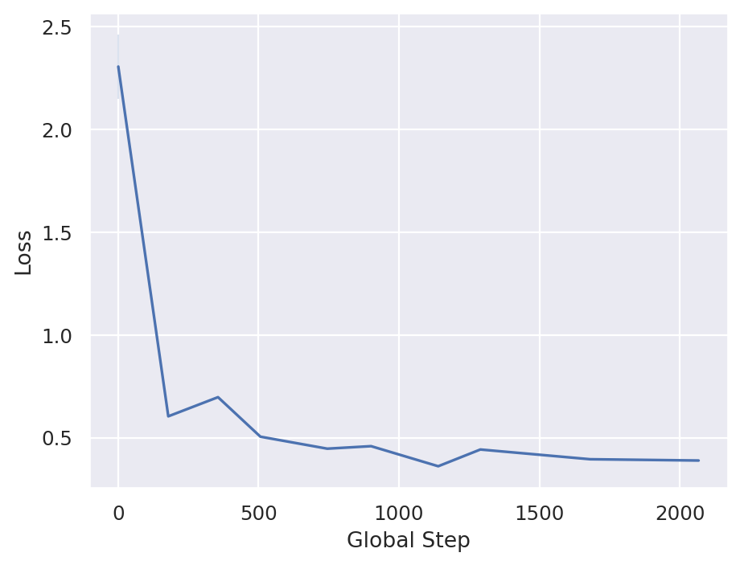

# Experiments

_This guide demonstrates the flow of generating metrics about training data and plotting it._

### Anatomy of an Experiment

- Choose a directory where you want to save measurements.
- Run a workload with the `--log_dir` option to produce a `metrics.csv` file.
- Write a simple plotting script to visualize the results.

## Example Experiment: Training Loss vs Training Step

__Goal:__ We are going to use the included mnist_jax workload to train an MLP model, record the loss curve, and plot it.

__TLDR:__ This guide is summarized into two scripts:
[measure_loss.sh](./simple_example_mnist_loss/measure_loss.sh) and [plot_loss.py](./simple_example_mnist_loss/plot_loss.py).


### 1. Create output location

Choose a directory where you want to save measurements:
```bash
$ LOG_DIR=./experiments/simple_example_mnist_loss/logs
$ mkdir -p $LOG_DIR
```

### 2. Run a Workload

Run a workload with the `--log_dir` option to produce a `metrics.csv` file. Here we run the simplest workload, an MLP JAX model with the MNIST dataset, for only 2 training trials with hyperparameters randomly picked from the acceptable range specified in `tuning_search_space.json`.
```bash
$ python3 algorithmic_efficiency/submission_runner.py \
    --framework=jax \
    --workload=mnist_jax \
    --submission_path=baselines/mnist/mnist_jax/submission.py \
    --tuning_search_space=baselines/mnist/tuning_search_space.json \
    --num_tuning_trials=2 \
    --log_dir=$LOG_DIR 2>&1 | tee -a $LOG_DIR/console_output.log
```

Take a look at the output files:
```
./logs/console_output.log
./logs/mnist_jax/metadata.json
./logs/mnist_jax/packages.txt
./logs/mnist_jax/run_1/metrics.csv
./logs/mnist_jax/run_2/metrics.csv
```

What are these output files?

Three files are written to the `log_dir` folder:
  1. `metadata.json` is created at the start of a workload and it includes the
     datetime, workload name, and system configuration.
  2. `metrics.csv` is created for each hyperparameter tuning trial and a row is
     appended for every model evaluation. The information included is loss,
     accuracy, training step, time elapsed, hparams, workload properties,
     and hardware utilization.
  3. `packages.txt` is created at the start of a workload and it includes a
     list of the currently installed OS and python packages.

### 3. Inspect the output of `metadata.json`

```
{
    "workload": "mnist_jax",
    "log_dir": "./experiments/simple_example_mnist_loss/logs",
    "datetime": "2022-03-04T20:59:51.602377",
    "python_version": "3.8.10",
    "python_compiler": "GCC 9.3.0",
    "os_platform": "Linux-5.4.48-x86_64-with-glibc2.29",
    "git_branch": "main",
    "git_commit_hash": "11f4544a72e7781291de1ee6404d1581eae6601a",
    "cpu_model_name": "AMD EPYC 7601 32-Core Processor",
    "cpu_count": 64,
    "gpu_model_name": "GeForce RTX 2080 Ti",
    "gpu_count": 4,
    "gpu_driver": "460.27.04",
    "workload.eval_period_time_sec": 10,
    "workload.max_allowed_runtime_sec": 60,
    "workload.num_eval_examples": 10000,
    "workload.num_train_examples": 60000,
    "workload.target_value": 0.3,
    "workload.train_mean": 0.1307,
    "workload.train_stddev": 0.3081
}
```

### 4. Inspect the output of `metrics.csv`

Note: to fit the data on screen we have transposed the CSV below and are displaying just one row.

| Column Name                      | Row Value         |
|----------------------------------|-------------------|
| framework                        | jax               |
| run_idx                          | 1.00              |
| accumulated_submission_time      | 2.62              |
| global_step                      | 1.00              |
| epoch                            | 0.02              |
| accuracy                         | 0.09              |
| loss                             | 2.56              |
| batch_size                       | 1024.00           |
| hparam.learning_rate             | 0.00              |
| hparam.one_minus_beta_1          | 0.93              |
| hparam.epsilon                   | 0.00              |
| workload.eval_period_time_sec    | 10.00             |
| workload.max_allowed_runtime_sec | 60.00             |
| workload.num_eval_examples       | 10000.00          |
| workload.num_train_examples      | 60000.00          |
| workload.target_value            | 0.30              |
| workload.train_mean              | 0.13              |
| workload.train_stddev            | 0.31              |
| steps_per_epoch                  | 58.00             |
| global_start_time                | 1646427004.12     |
| goal_reached                     | FALSE             |
| cpu.util.avg_percent_since_last  | 6.00              |
| cpu.freq.current                 | 2.67              |
| temp.k10temp.current             | 33.50             |
| mem.total                        | 135058636800.00   |
| mem.available                    | 122886062080.00   |
| mem.used                         | 10919899136.00    |
| mem.percent_used                 | 9.00              |
| mem.read_bytes_since_boot        | 32128228457472.00 |
| mem.write_bytes_since_boot       | 2799576596480.00  |
| net.bytes_sent_since_boot        | 2938962.00        |
| net.bytes_recv_since_boot        | 75793608.00       |
| gpu.count                        | 1.00              |
| gpu.0.compute.util               | 0.05              |
| gpu.0.mem.util                   | 0.98              |
| gpu.0.mem.total                  | 11019.00          |
| gpu.0.mem.used                   | 10853.00          |
| gpu.0.mem.free                   | 166.00            |
| gpu.0.temp.current               | 35.00             |
| gpu.avg.compute.util             | 0.05              |
| gpu.avg.mem.util                 | 0.98              |
| gpu.avg.mem.total                | 11019.00          |
| gpu.avg.mem.used                 | 10853.00          |
| gpu.avg.mem.free                 | 166.00            |
| gpu.avg.temp.current             | 35.00             |
|                                  |                   |

### 5. (Optional) Combine CSVs if necessary

By default, one `metrics.csv` is produced per training run, ie. a `metrics.csv` has data partaining to one hyperparameter tuning trial. In our example above we choose to run 2 tuning trials, but the default for an MNIST workload is 20 tuning trials. Combining all the `metrics.csv` files across hyperparameter tuning trials is left to users, but a convienence function called `concatenate_csvs()` is provided and demonstrated below. The data format of `metrics.csv` is designed to be safe to arbitrarily join CSVs without attribute name conflicts across hyperparameter tuning trials or even workloads. It is not done automatically for you because we do not want to create data duplication if there is no need.

You can join all files named `metrics.csv` in a given folder recursively with this bash command:

```bash
$ python3 -c "from algorithmic_efficiency import logging_utils; logging_utils.concatenate_csvs('$LOG_DIR')"
````

This will produce a file called:
```bash
./logs/all_metrics.csv
```

### 6. (Optional) Label your experiments

You can also specify arbitrary extra metadata to be saved alongside the output CSVs metrics and JSON metadata. This is useful when doing multiple experiments and needing a way to tell data apart. To do this use the option `--record_extra_metadata="key=value"`. You can specify this option multiple times. Choose a unique key that is not likely to overlap with other CSV/JSON data attributes.

### 7. Write a simple plotting script to visualize the results.

For example this minimal plot script:

```python
import matplotlib.pyplot as plt
import pandas as pd
import seaborn as sns

# Read Data
input_file = './experiments/simple_example_mnist_loss/logs/all_metrics.csv'
df = pd.read_csv(input_file)

# Plot
sns.set_theme()
fig, ax = plt.subplots()
sns.lineplot(data=df, ax=ax, x='global_step', y='loss')

# Style
ax.set_ylabel('Loss')
ax.set_xlabel('Global Step')

# Save
fig.savefig('plot_loss.png', transparent=False, dpi=160, bbox_inches="tight")
```

Will produce the following loss curve:


